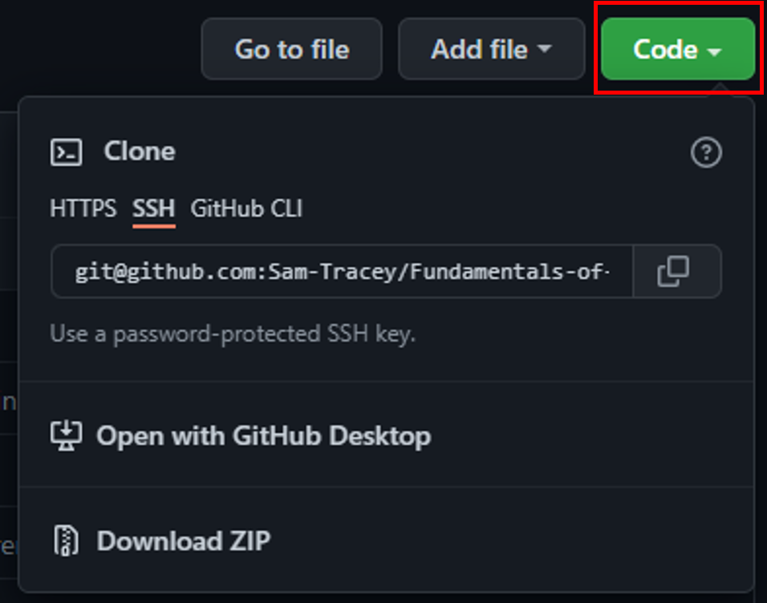
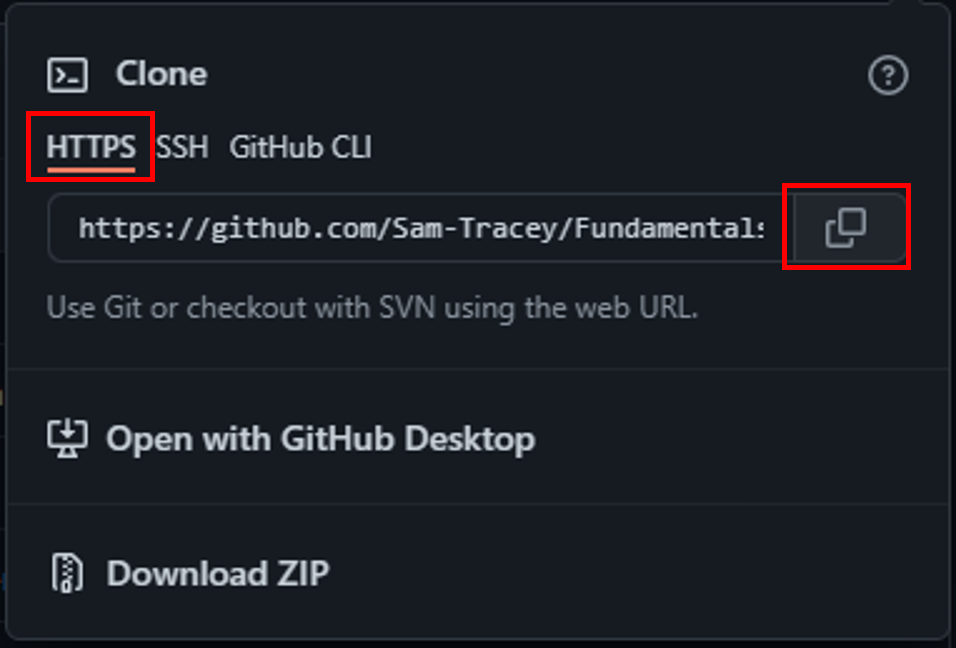
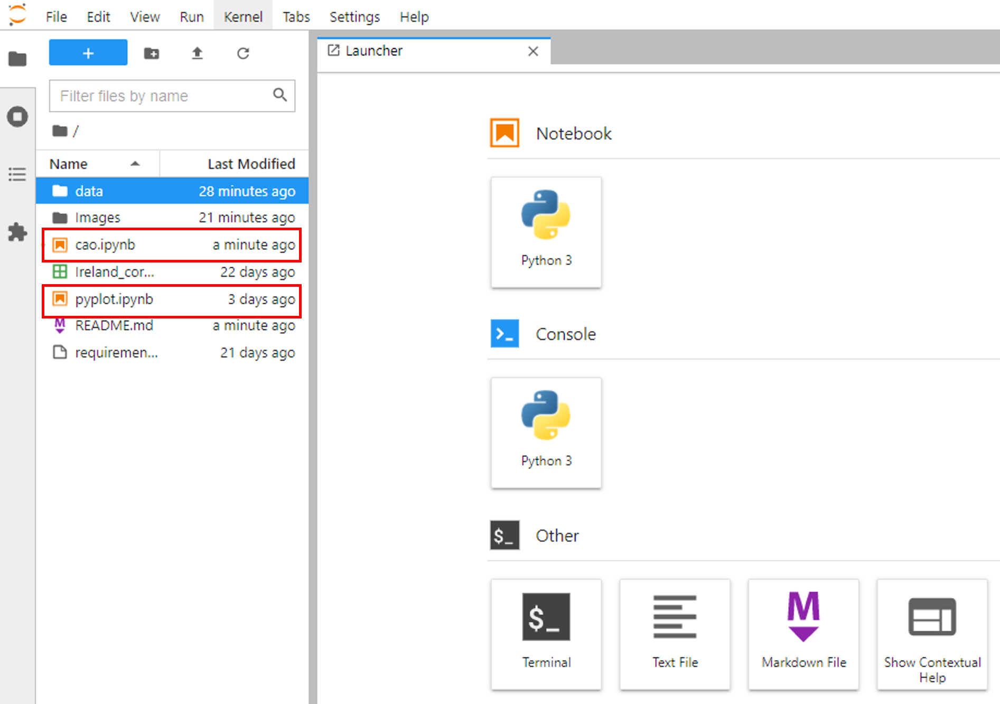
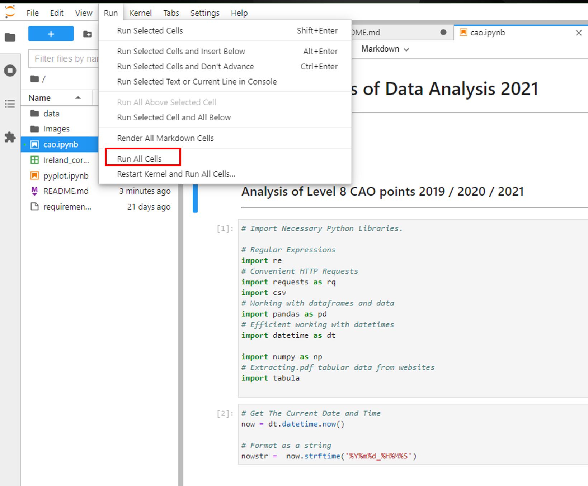

***

# Fundamentals-of-Data-Analysis Course Work 2021.

### Name: Sam Tracey
### Student ID: G00398245
### Submission Date: January 2022

***

## Introduction.

This repository contains two Jupyter Notebooks and associated files demonstrating my Python programming for the module
"Fundamentals of Data Analysis" 2021 using the following Python packages:

- <code>pandas</code> https://pandas.pydata.org/docs/
- <code>numpy</code> https://numpy.org/doc/
- <code>re</code> https://docs.python.org/3/library/re.html
- <code>requests</code> https://docs.python-requests.org/en/latest/
- <code>datetime</code> https://docs.python.org/3/library/datetime.html
- <code>tabula</code> https://tabula-py.readthedocs.io/en/latest/
- <code>matplotlib.pyplot</code> https://matplotlib.org/stable/api/_as_gen/matplotlib.pyplot.html
- <code>seaborn</code> https://seaborn.pydata.org/
- <code>scipy</code> https://docs.scipy.org/doc/scipy/reference/
- <code>probscale</code> https://matplotlib.org/mpl-probscale/
- <code>plotly</code> https://plotly.com/python/
    

    
## Problem Statement.
 
There are two separate notebooks included in this repository.

**The following Problem statement refers to the "pyplot.ipynb" notebook:**

> Include a Jupyter notebook called pyplot.ipynb that contains the following.
> - A clear and concise overview of the matplotlib.pyplot Python package, pitched at your classmates.
> - An in-depth explanation of three interesting plots from the matplotlib.pyplot Python package. 
> You have free reign to choose the three plots yourself.

**The following Problem statement refers to the "cao.ipynb" notebook:**

> Include a Jupyter notebook called cao.ipynb that contains the following.
> - A clear and concise overview of how to load CAO points information from the CAO website into a pandas data frame, pitched at your classmates.
> - A detailed comparison of CAO points in 2019, 2020, and 2021 using the functionality in pandas.
> - Appropriate plots and other visualisations to enhance your notebook for viewers

## Steps to Download This Repository.

1. Open your browser and paste the following into the address bar: https://github.com/Sam-Tracey/Fundamentals-of-Data-Analysis
2. Above the list of files click the green Code button:

 

3. Click on HTTPS then the "copy" icon:

 
4. Open your preferred Command Line interface (CLI). During this project I used Cmder which can be downloaded at: https://cmder.net/  
5. Navigate to the directory into which you wish to clone the repository e.g cd Users\yourname\Desktop  
6. Type git clone and then the paste the URL you copied in step 3 above: <code>λ git clone https://github.com/Sam-Tracey/Fundamentals-of-Data-Analysis.git</code>  

 

## Installing Necessary Packages.

The notebooks in this repository were created in Jupyter Lab which was included in the most recent (at the time of writing) version of Anaconda. I would strongly suggest 
updating your version of Anaconda at the following link: https://www.anaconda.com/products/individual#Downloads. This version of Anaconda contains 9 of the 10 packages that are used
in both of these notebooks.

There is one package used in the cao.ipynb notebook which you will need to install.

To install Tabula.py:

1. Open the Anaconda Prompt terminal.
2. Type in: <code>conda install -c conda-forge tabula-py</code> and press enter.

## Running the Notebooks.

1. Open your Command Line Interface (CLI).
2. Navigate to the directory in which you cloned the repository.
3. In your CLI type: <code>jupyter lab</code>
4. A browser window will open with Jupyter Lab Running.
5. In the left hand window you will see two .ipynb files:

 

6. Double click on either one to open the code.
7. In the Menu Bar select: Run > Run All Cells:

 

## Navigating the Notebooks.

When you have successfully run all cells in each notebook feel free to look around!

The notebook cao.ipynb can be split into several different sections:

### 1. Importing Data From The CAO Website.

If you have never had to import data from the official CAO website , you should feel lucky! Initially there were three different types of file to import for the three years of CAO points.
CAO 2019 Points were in .pdf format.
CAO 2020 Points were in .xlsx format.
CAO 2021 Points were in .php format.

Two months into this project the CAO decided to change the CAO 2021 points to .xlsx and, while the original .php link still works I decided to change my code to import the .xlsx file as it contained
several more useful data fields. You will see that I left the code for importing the CAO 2021 .php format in the notebook but the cells have been converted to "Raw" type. If you want to run the code in these cells please convert them to "Code".

### 2. Data Wrangling.

The next section of the cao.ipynb notebook involves data wrangling. In this section I manipulate the imported data from CAO 2019, CAO 2020 and CAO 2021 into one cohesive dataframe upon which the analysis is performed.

### 3. Exploratory Data Analysis.

The final section involves data exploration using visualisations and statistical analysis where appropriate. 
Visualizations include:
- Histograms.
- KDE Plots.
- Box Plots.
- Bar plots.
- Scatter Plots.

Statistical Analysis includes:
- Hypothesis Testing using Spearman R Test.
- Correlation analysis.

The notebook plot.ipynb can also be split into two different sections:

### 1. An overview of the <code>matplotlib.pyplot</code>.

This section gives a brief introduction into the package and walks through the process of building a chart using Fig and axes. Feel free to modify the x,y or z values in this sections to see how these values modify the charts produced.

### 2. An Indepth Description Into Three Pyplot Charts.

In this section I decided to use a time series plot, barplot and boxplot to create a Covid-19 dashboard.
The dashboard evaluates the Covid-19 cases in Ireland per day, the Covid-19 deaths per day, the vaccination rate per European Country and finally the vaccination rates worldwide.

## Trouble Shooting.

1. Data Will Not Load From URL.

Both of these notebooks retrieve data from official websites at specific URLs. In the case that the URLs change or the websites themselves are removed I wanted to provide a method for the notebooks to still function even without being able to retrieve the data. If you find that either notebook generates errors when loading the data from any of the URLs I have included an "In Case of Emergency" section in a mark down cell within each notebook. Please follow the instructions in this section to enable you to load a version of the data stored locally in the repository.

2. Issues Running Tabula.py.

The tabula.py package is used to extract data from .pdf documents and is used in the cao.ipynb notebook. The tabula.py package relies on Java being installed on your machine. If you have any issues with installing tabula.py please consult the documentation at the following link: https://tabula-py.readthedocs.io/en/latest/getting_started.html

3. Notebook Images not Rendering Properly in Github.

There are intermittent issues with embedded images not rendering correctly when viewed in a Github repository. If this should happen when you are viewing this work I have created a static HTML web page version of each notebook using nbviewer.

Link to static cao.ipynb notebook: https://nbviewer.org/github/Sam-Tracey/Fundamentals-of-Data-Analysis/blob/main/cao.ipynb
Link to static pyplot.ipynb notebook: https://nbviewer.org/github/Sam-Tracey/Fundamentals-of-Data-Analysis/blob/main/pyplot.ipynb

